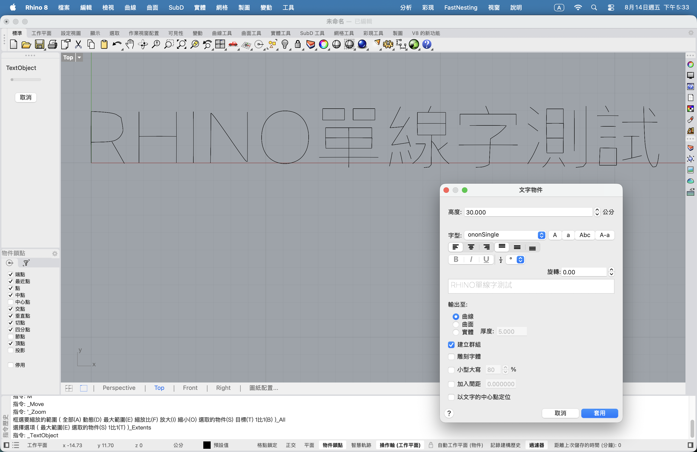

# ononSingle

`ononSingle` 是一套供 CNC、雷射雕刻與單線文字工作流程使用的繁體中文實驗字型。

> **來源說明：本字型改編自 LINE Seed TW Thin 1.400。**  
> 原字型 Copyright © 2025 LY Corporation，依 SIL Open Font License 1.1 授權。`LINE Seed TW` 是原作者保留名稱；本專案的衍生字型使用新的家族名稱 `ononSingle` 與 `ononSingleText`，與 LY Corporation 或 LINE 官方無關，也未獲官方背書。

## 下載

[下載 ononSingle.ttf](./ononSingle.ttf)

[下載 ononSingleText.ttf](./ononSingleText.ttf)

## 為什麼需要兩款字型？

Rhino 對真正單線字型與一般可編輯文字使用不同的輪廓處理方式，因此本專案提供兩個用途不同、可以同時安裝的字型家族：

| 字型 | 適用功能 | 輪廓特性 | 主要用途 |
| --- | --- | --- | --- |
| `ononSingle.ttf` | `TextObject（文字物件）`＋`Engraving font` | 真正單線加工路徑 | CNC、雷射雕刻及單刀路徑輸出 |
| `ononSingleText.ttf` | 一般 `Text（文字方塊）` | 極細的合法封閉輪廓 | 需要保留可編輯文字及正常畫面顯示時使用 |

`ononSingleText` 為避免一般文字填色器產生黑色方塊，必須讓筆畫具有極細寬度；因此炸開後會得到筆畫內外兩側的雙線。若加工時需要真正單線，請使用 `ononSingle` 與 `TextObject`。兩款字型無法互相取代，而是分別解決「單線加工」與「可編輯文字」兩種需求。

`ononSingleText` 的技術說明與測試方式請參閱 [`experiments/ononSingleText.md`](./experiments/ononSingleText.md)。

## 改編內容

- 從 LINE Seed TW Thin 提取筆畫中心骨架。
- 將方向連續的端點合併，減少抬刀與重複短路徑。
- 簡化細碎造型與不必要的像素轉折。
- 使用 TrueType 二次 Bézier 曲線改善 `O`、撇、捺、彎鉤與中文字弧線。
- 保留橫、豎、方框及明顯折筆的銳利轉角。
- 修復 `R`，分為直幹、上方碗形及右下斜腿。
- 修復 `l`、`I`、`一`與其他共線筆畫被渲染器視為退化輪廓而消失的問題。
- 保留來源字型的 Unicode 映射、字寬及基線。

## 字型資訊

- 檔名：`ononSingle.ttf`
- 內部家族名稱：`ononSingle`
- 樣式：`Regular`
- 版本：`1.3.1`
- Unicode 映射：13,918
- Glyph 數量：13,919（含 `.notdef`）
- TrueType 二次曲線控制點：300,896
- 實驗性雕刻輪廓：158,971

## 預覽

### Rhino 8 實際使用

下圖是在 Rhino 8 的 `TextObject` 中選用 **ononSingle**，並輸出成單線曲線的實際畫面。

### 字形處理比較

下圖每個字由上至下依序是原始骨架、筆畫連貫版，以及保留尖角的平滑曲線版。

## Rhino 使用方式

1. 安裝 `ononSingle.ttf` 後，完全重新啟動 Rhino。
2. 執行 `TextObject`，選擇 **ononSingle**。
3. 選擇輸出為曲線，並手動啟用 **Engraving font／雕刻字型**。
4. 建議先測試 `R O l I 一 線字測試 圓潤`。
5. 正式加工前，依實際刀徑、雷射光斑、材料與字高檢查輸出曲線。

Rhino 只對少數內建雕刻字型提供特殊預覽；新字型在一般文字對話框可能顯示很淡、部分線條或空白。後續 DXF／CAM 匯出也可能把二次曲線細分為短線，請依使用軟體調整曲線容差。

## 注意事項

這是自動骨架與幾何最佳化產生的實驗版本，並非逐字人工修訂的商用品質字型。複雜中文字可能仍有不理想的分支、走刀順序或局部造型。大量加工前請務必轉成曲線並逐字抽查。

驗證摘要請參閱 [`docs/QA.txt`](./docs/QA.txt)，各版本改動記錄請參閱 [`FONTLOG.txt`](./FONTLOG.txt)。

## 修改版名稱規範

本專案依照 [OFL 官方修改字型指引](https://openfontlicense.org/how-to-modify-ofl-fonts/) 發佈：

- 原字型的保留名稱 `LINE Seed TW` 不用於修改版的檔名、家族名稱、完整名稱或 PostScript 名稱。
- 修改版使用可清楚區別於原字型的家族名稱：單線加工版為 `ononSingle`，一般文字版為 `ononSingleText`；檔名、完整名稱及 PostScript 名稱亦採用相同的新名稱系統。
- 原字型名稱只出現在來源說明、copyright、description、`OFL.txt` 與 `FONTLOG.txt`，不作為使用者可選取的字型家族名稱。
- 兩款字型均屬 Modified Version；字型 metadata、`OFL.txt` 與 `FONTLOG.txt` 保留原始著作權並加入修改者聲明，且不暗示 LY Corporation 或 LINE 的關聯或背書。

## 授權

本專案包含的字型是 LINE Seed TW 的衍生字型，沿用 [SIL Open Font License 1.1](./OFL.txt)。散布、修改或再發佈時，請遵守 `OFL.txt` 中的全部條件；另附 [OFL-FAQ.txt](./OFL-FAQ.txt) 供參考。重點包括：

- 衍生字型仍須使用 OFL 1.1。
- 必須保留原始版權及授權聲明。
- 不得將 `LINE Seed TW` 用作衍生字型的主要名稱，除非取得權利人的書面許可。
- 不得暗示 LY Corporation 或原作者為本衍生版本背書。

原始字型與品牌權利均屬各自權利人所有。
