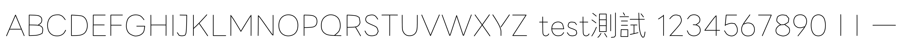

# ononSingle Text V2

這是針對 Rhino `Text（文字方塊）` 的第二個獨立測試版，不會取代任何既有字型。

## 第二版調整

- 使用全新家族名稱 `ononSingle Text V2`，避免 macOS 或 Rhino 沿用第一版字型快取。
- 版本識別改為 `0.2`，PostScript 名稱改為 `ononSingleTextV2-Regular`。
- 將封閉細輪廓從 12 units 加寬為 24 units，降低小尺寸渲染時輪廓兩側重合或被捨棄的機率。
- 每個筆畫先建立合法封閉輪廓，再合併交疊區域，外圈使用 TrueType 順時針方向、孔洞使用逆時針方向。
- 不包含 `Engraving: Singlestroke` 標記，避免 Rhino 以未被白名單接受的單線方式處理。

## 預期結果與限制

- 一般 `Text` 應顯示為極細實心筆畫，不應出現整片黑色三角形或圓塊。
- 炸開後仍會得到筆畫內外兩側的雙線，不是真正單刀路徑。
- 真正單線加工仍請使用 `ononSingle.ttf` 搭配 `TextObject`。

## 標準填色渲染預覽



## 測試方式

1. 安裝 `ononSingleTextV2.ttf` 並完全重新啟動 Rhino。
2. 在字型欄確認選到完整名稱 `ononSingle Text V2`。
3. 使用一般 `Text` 建立 `ABCDEFGHIJKLMNOPQRSTUVWXYZ` 與 `test測試`。
4. 檢查畫面及炸開輪廓。

## 重建

```sh
python3 tools/build_text_compatible.py --profile v2 \
  ononSingle.ttf ononSingleTextV2.ttf
```
