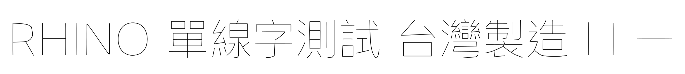

# ononSingle Text Experimental

這是獨立於 `ononSingle.ttf` 的 Rhino `Text（文字方塊）` 相容性實驗版，不會取代目前的單線字型。

## 檔案

- 原單線版本：`ononSingle.ttf`
- Text 實驗版本：`ononSingleText-Experimental.ttf`
- 內部家族名稱：`ononSingle Text Experimental`

兩個字型可以同時安裝。

## 一般填色渲染預覽

下圖由 HarfBuzz 以標準填色文字方式產生，測試字串沒有出現黑色方塊。



## 處理方式

實驗版將原本往返重疊、接近零面積的中心線輪廓轉為 12 units 寬的合法封閉輪廓，並合併交疊區域，避免一般文字填色器把字框錯誤填滿成黑色方塊。

## 重要限制

- 此版本在 `Text` 中顯示為極細筆畫，但不再是真正的單線輪廓。
- 將它轉成曲線後會得到筆畫的內外兩側，不適合直接作為單刀路徑。
- CNC／雷射單線加工仍應使用原本的 `ononSingle.ttf` 搭配 `TextObject`。
- 這是自動轉換的實驗版本，正式加工前仍須逐字檢查。

## 重建

```sh
python3 tools/build_text_compatible.py \
  ononSingle.ttf ononSingleText-Experimental.ttf
```
